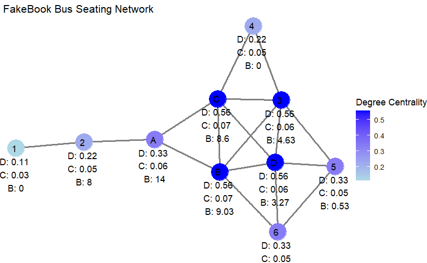
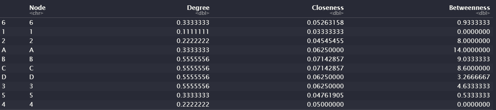

```{r setup, include=FALSE}
knitr::opts_chunk$set(echo = TRUE)
```

```{r}
library(igraph)
library(ggraph)

edges_df <- data.frame(
  node_1 = c('6', '6', '6', '1', '2', 'A', 'A', 'B', 'B', 'B', 'C', 'C', 'C', 'D', 'D', '3', '3'),
  node_2 = c('5', 'D', 'B', '2', 'A', 'B', 'C', 'C', 'D', '3', 'D', '3', '4', '3', '5', '5', '4')
)
g <- graph_from_data_frame(edges_df, directed = FALSE)

```

```{r}

# The number of direct connections a node has

V(g)$degree <- degree_centrality

# The average length of the shortest paths from the node to all other nodes
# Represents how 'close' a node is to all other nodes in the network

V(g)$closeness <- closeness_centrality

# Quantifies the number of times a node acts as a bridge along the shortest path between two other nodes
# Indicates the node's ability to influence the spread of information or resources across the network
# Reflects the node's control over the interactions in the network

V(g)$betweenness <- betweenness_centrality

V(g)$label <- paste(V(g)$name, '\nD:', round(degree_centrality, 2), '\nC:', round(closeness_centrality, 2), '\nB:', round(betweenness_centrality, 2))

```

```{r}

ggraph(g, layout = 'stress') + 
  geom_edge_link(color = "gray50", width = 1) + 
  geom_node_point(aes(color = degree), size = 10) + 
  geom_node_text(aes(label = label), nudge_y = -0.25, fontface = "plain", color = "black", size = 4) +
  scale_color_gradient(low = "lightblue", high = "blue") + 
  theme_void() +
  labs(title = " FakeBook Bus Seating Network",
       color = "Degree Centrality")
```

###### The above plot colors the nodes based on centrality measures, with the darkest blue nodes having the highest degree centrality values.

```{r}

centralities_df <- data.frame(
  Node = names(degree_centrality),
  Degree = degree_centrality,
  Closeness = closeness_centrality,
  Betweenness = betweenness_centrality
)
print(centralities_df)
```
 

Degree Centrality:

-   B, C, D have the highest degree centrality (0.56)
-   A has a lower degree centrality (0.33)

This suggests that seats B, C, and D are more directly connected to other nodes than A.

Closeness Centrality:

-   B and C have the highest closeness centrality (0.071).
-   A and D have slightly lower closeness centrality (0.062).

This indicates that from seats B and C, you can reach all other nodes more quickly than from A or D.

Betweenness Centrality:

-   A has the highest betweenness centrality (14).
-   B is next (9.03), followed closely by C (8.6).
-   D has lower betweenness centrality (3.27).

This suggests seat A plays a critical role in the network's connectivity, and acts as a key intermediary more often than the others.

Based on the centrality measures: Seat B or C

Reasons:

-   Maximize direct interactions and be a central figure in communication

-   Due to their high degree and closeness centralities

-   Enhanced networking opportunities due to high degree and closeness

-   Greater influence in the spread of information due to a more central position

Consequences:

-   Potential for distraction due to numerous direct interactions.
-   Less privacy and downtime during commutes.
